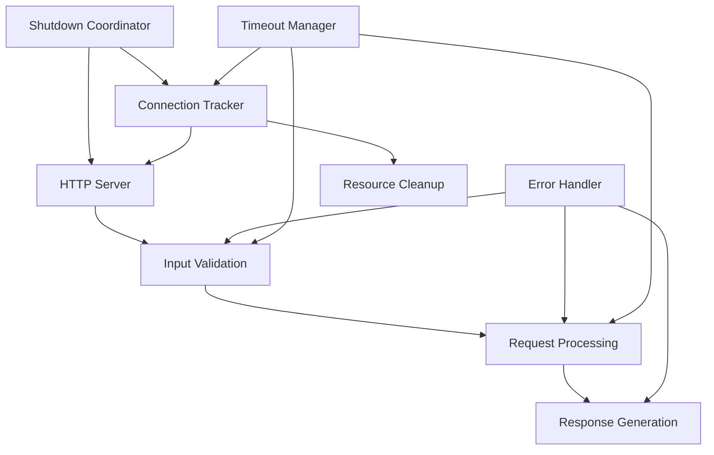

# hao-backprop-test

A robust, production-ready HTTP server testing utility for machine learning integration and backpropagation algorithm validation. Built with enterprise-grade reliability features while maintaining zero external dependencies.

## Table of Contents

- [Overview](#overview)
- [Features](#features)
- [Quick Start](#quick-start)
- [Enhanced Server Capabilities](#enhanced-server-capabilities)
- [API Documentation](#api-documentation)
- [Configuration Reference](#configuration-reference)
- [Architecture](#architecture)
- [Operational Guide](#operational-guide)
- [Troubleshooting](#troubleshooting)
- [Contributing](#contributing)
- [License](#license)

## Overview

This project provides a minimalist yet robust HTTP server implementation designed as a foundational testing utility for machine learning integration patterns. The server implements comprehensive robustness features including error handling, graceful shutdown, input validation, and resource management while maintaining Node.js built-in modules only architecture.

### Key Characteristics

- **Zero Dependencies**: Uses only Node.js built-in modules for maximum compatibility
- **Production-Ready**: Enterprise-grade error handling and graceful shutdown capabilities
- **Lightweight**: Minimal resource footprint (<50MB baseline) with comprehensive monitoring
- **Development-Focused**: Optimized for rapid testing and validation workflows

## Features

### Core Features

- **F-001: HTTP Server Functionality** - Reliable network communication layer with IPv4 loopback binding
- **F-002: Static Response Generation** - Consistent "Hello, World!" message delivery for testing
- **F-003: Server Status Logging** - Console feedback for server initialization and operations
- **F-004: Zero-Dependency Architecture** - Complete independence from external npm packages

### Enhanced Robustness Features

- **F-005: Robust Error Handling** - Comprehensive error management preventing process termination
- **F-006: Graceful Shutdown** - Signal-based controlled termination with connection draining
- **F-007: Input Validation** - Request sanitization and validation pipeline
- **F-008: Resource Cleanup** - Connection lifecycle management and memory monitoring
- **F-009: Enhanced HTTP Processing** - Production-grade HTTP/1.1 features with security headers

## Quick Start

### Prerequisites

- Node.js v8+ (v16+ recommended)
- Port 3000 available on localhost
- 512MB RAM minimum (1GB recommended)

### Installation

```bash
# Clone the repository
git clone <repository-url>
cd hao-backprop-test

# Verify Node.js installation
node --version
npm --version

# Start the server
node server.js
```

### Expected Output

```
Server running at http://127.0.0.1:3000/
Error handling initialized
Graceful shutdown handlers registered
Input validation layer active
Resource monitoring started
```

### Testing the Server

```bash
# Basic functionality test
curl http://127.0.0.1:3000/

# Expected response: Hello, World!

# Test different HTTP methods
curl -X POST http://127.0.0.1:3000/
curl -X PUT http://127.0.0.1:3000/
curl -X DELETE http://127.0.0.1:3000/
```

### Graceful Shutdown

```bash
# Recommended shutdown method
npm run stop

# Alternative: Send SIGTERM signal
kill -TERM <process_id>

# For development: Ctrl+C (triggers SIGINT)
```

## Enhanced Server Capabilities

### Error Handling System

The server implements comprehensive error management through custom error classes and structured error responses:

#### Custom Error Types

- **ValidationError**: Input validation failures
- **TimeoutError**: Request timeout scenarios  
- **ShutdownError**: Graceful shutdown issues

#### Error Response Structure

```json
{
  "error": {
    "status": 400,
    "message": "Invalid request format",
    "type": "ValidationError",
    "timestamp": "2024-01-01T12:00:00.000Z",
    "details": {
      "field": "Content-Type",
      "expected": "application/json",
      "received": "text/html"
    }
  }
}
```

### Graceful Shutdown Process

The server supports controlled termination through signal handling:

1. **Signal Reception**: Monitors SIGTERM, SIGINT, and SIGUSR2
2. **Connection Draining**: Stops accepting new connections
3. **Active Request Completion**: Allows in-flight requests to finish
4. **Resource Cleanup**: Releases connections, timers, and event listeners
5. **Clean Exit**: Process terminates with appropriate exit code

### Input Validation Pipeline

Comprehensive request validation includes:

- **HTTP Method Verification**: Only allowed methods accepted
- **Header Validation**: Content-Type and security headers checked
- **Payload Size Limits**: Prevents resource exhaustion attacks
- **URL Path Sanitization**: Blocks directory traversal attempts

### Resource Management

Active monitoring and cleanup of:

- **Connection Registry**: Tracks all active HTTP connections
- **Memory Usage**: Monitors resource consumption
- **Request Timeouts**: Prevents hanging operations
- **Event Listener Cleanup**: Prevents memory leaks

## API Documentation

### Endpoints

#### GET, POST, PUT, DELETE /

Returns a static "Hello, World!" message for all valid HTTP methods.

**Response (Success)**
```http
HTTP/1.1 200 OK
Content-Type: text/plain
X-Content-Type-Options: nosniff
X-Frame-Options: DENY

Hello, World!
```

### Error Responses

The server returns structured error responses with appropriate HTTP status codes:

#### 400 Bad Request

Returned for malformed requests or validation failures.

```http
HTTP/1.1 400 Bad Request
Content-Type: application/json

{
  "error": {
    "status": 400,
    "message": "Invalid request format",
    "type": "ValidationError",
    "timestamp": "2024-01-01T12:00:00.000Z"
  }
}
```

#### 405 Method Not Allowed

Returned for unsupported HTTP methods.

```http
HTTP/1.1 405 Method Not Allowed
Content-Type: application/json
Allow: GET, POST, PUT, DELETE

{
  "error": {
    "status": 405,
    "message": "HTTP method not supported",
    "type": "ValidationError",
    "timestamp": "2024-01-01T12:00:00.000Z"
  }
}
```

#### 408 Request Timeout

Returned when request processing exceeds timeout limits.

```http
HTTP/1.1 408 Request Timeout
Content-Type: application/json

{
  "error": {
    "status": 408,
    "message": "Request processing timeout",
    "type": "TimeoutError",
    "timestamp": "2024-01-01T12:00:00.000Z"
  }
}
```

#### 413 Payload Too Large

Returned when request payload exceeds size limits.

```http
HTTP/1.1 413 Payload Too Large
Content-Type: application/json

{
  "error": {
    "status": 413,
    "message": "Request payload exceeds maximum size",
    "type": "ValidationError",
    "timestamp": "2024-01-01T12:00:00.000Z"
  }
}
```

#### 500 Internal Server Error

Returned for unexpected server errors.

```http
HTTP/1.1 500 Internal Server Error
Content-Type: application/json

{
  "error": {
    "status": 500,
    "message": "Internal server error",
    "type": "ServerError",
    "timestamp": "2024-01-01T12:00:00.000Z"
  }
}
```

## Configuration Reference

### Environment Variables

Configure server behavior through environment variables:

```bash
# Server Configuration
PORT=3000                           # Server port (default: 3000)
HOST=127.0.0.1                      # Server host (default: 127.0.0.1)

# Timeout Settings
REQUEST_TIMEOUT=60000               # Request timeout in ms (default: 60000)
VALIDATION_TIMEOUT=5                # Validation timeout in ms (default: 5)
KEEPALIVE_TIMEOUT=30000             # Keep-alive timeout in ms (default: 30000)

# Shutdown Configuration
SHUTDOWN_GRACE_PERIOD=30000         # Graceful shutdown timeout in ms (default: 30000)
FORCE_SHUTDOWN_DELAY=5000           # Force shutdown delay in ms (default: 5000)

# Validation Rules
MAX_PAYLOAD_SIZE=1048576            # Maximum request payload in bytes (default: 1MB)
ALLOWED_METHODS=GET,POST,PUT,DELETE # Allowed HTTP methods (default: GET,POST,PUT,DELETE)

# Resource Limits
MAX_CONNECTIONS=1000                # Maximum concurrent connections (default: 1000)
MEMORY_THRESHOLD=104857600          # Memory usage threshold in bytes (default: 100MB)
```

### Configuration Examples

#### Development Configuration

```bash
# .env.development
PORT=3000
REQUEST_TIMEOUT=30000
SHUTDOWN_GRACE_PERIOD=10000
MAX_PAYLOAD_SIZE=512000
LOG_LEVEL=debug
```

#### Production Configuration

```bash
# .env.production
PORT=3000
REQUEST_TIMEOUT=60000
SHUTDOWN_GRACE_PERIOD=30000
MAX_PAYLOAD_SIZE=1048576
LOG_LEVEL=warn
MEMORY_THRESHOLD=52428800
```

## Architecture

### Project Structure

```
hao-backprop-test/
├── server.js                    # Main HTTP server implementation
├── lib/                         # Utility modules
│   ├── errors.js               # Custom error classes and handling
│   ├── validation.js           # Input validation utilities
│   └── shutdown.js             # Graceful shutdown coordination
├── package.json                # Project configuration with npm scripts
├── package-lock.json           # Dependency version management
└── README.md                   # Project documentation
```

### Module Dependencies

#### lib/errors.js

Custom error classes for different failure scenarios:

```javascript
// Usage example
const { ValidationError, TimeoutError, ShutdownError } = require('./lib/errors');

try {
  validateInput(request);
} catch (error) {
  if (error instanceof ValidationError) {
    response.status(400).json(error.toJSON());
  }
}
```

#### lib/validation.js

Input validation utilities:

```javascript
// Usage example  
const { validateHttpMethod, validateHeaders, validatePayloadSize } = require('./lib/validation');

const isValid = validateHttpMethod(request.method);
const headersValid = validateHeaders(request.headers);
const sizeValid = validatePayloadSize(request.headers['content-length']);
```

#### lib/shutdown.js

Graceful shutdown coordination:

```javascript
// Usage example
const { initializeShutdownHandlers, gracefulShutdown } = require('./lib/shutdown');

initializeShutdownHandlers(server);
// Shutdown handlers automatically manage termination process
```

### Component Integration



## Operational Guide

### Starting the Server

#### Basic Startup

```bash
# Start with default configuration
node server.js

# Start with custom port
PORT=8080 node server.js

# Start with debug logging
LOG_LEVEL=debug node server.js
```

#### Production Deployment

```bash
# Using PM2 process manager
pm2 start server.js --name "hao-backprop-test"

# Using systemd service
sudo systemctl start hao-backprop-test

# Using Docker
docker run -p 3000:3000 hao-backprop-test
```

### Monitoring Server Health

#### Health Check Endpoint

```bash
# Basic health check
curl -f http://127.0.0.1:3000/ || echo "Server unhealthy"

# Response time monitoring
curl -w "Response time: %{time_total}s\n" -o /dev/null -s http://127.0.0.1:3000/
```

#### Log Monitoring

```bash
# Monitor server logs in real-time
tail -f server.log

# Search for errors
grep "ERROR" server.log | tail -20

# Monitor shutdown events
grep "graceful shutdown" server.log
```

### Graceful Shutdown Procedures

#### Signal-Based Shutdown

```bash
# Graceful shutdown (recommended)
kill -TERM <process_id>

# Immediate shutdown (emergency only)
kill -KILL <process_id>

# User interrupt (development)
# Press Ctrl+C in terminal
```

#### Process Manager Integration

```bash
# PM2 graceful shutdown
pm2 stop hao-backprop-test

# systemd graceful shutdown  
sudo systemctl stop hao-backprop-test

# Docker graceful shutdown
docker stop <container_id>
```

### Performance Tuning

#### Connection Management

```bash
# Monitor active connections
ss -tuln | grep :3000

# Check connection limits
ulimit -n

# Monitor resource usage
top -p <process_id>
```

#### Memory Optimization

```bash
# Monitor memory usage
ps -p <process_id> -o pid,ppid,cmd,%mem,%cpu

# Check for memory leaks
node --inspect server.js
# Connect Chrome DevTools for memory profiling
```

## Troubleshooting

### Common Issues and Solutions

#### Server Won't Start

**Symptom**: Server fails to start with port binding error

```
Error: listen EADDRINUSE: address already in use :::3000
```

**Solution**: 
```bash
# Find process using port 3000
lsof -i :3000

# Kill the process
kill -9 <process_id>

# Or use different port
PORT=3001 node server.js
```

#### Request Validation Errors

**Symptom**: Clients receiving 400 Bad Request responses

**Solution**:
```bash
# Check request format
curl -v -H "Content-Type: application/json" http://127.0.0.1:3000/

# Verify allowed methods
curl -X OPTIONS http://127.0.0.1:3000/

# Check payload size
curl -X POST -d @large_file.json http://127.0.0.1:3000/
```

#### Graceful Shutdown Issues

**Symptom**: Server not shutting down cleanly

**Solution**:
```bash
# Check active connections
netstat -an | grep :3000

# Monitor shutdown process
LOG_LEVEL=debug node server.js
# Send SIGTERM and observe logs

# Force shutdown if needed
kill -KILL <process_id>
```

#### Memory Leaks

**Symptom**: Server memory usage continuously increasing

**Solution**:
```bash
# Enable memory monitoring
NODE_OPTIONS="--max-old-space-size=512" node server.js

# Check for connection leaks
ss -s | grep tcp

# Review error logs for cleanup failures
grep "cleanup" server.log
```

#### Timeout Issues

**Symptom**: Requests timing out unexpectedly

**Solution**:
```bash
# Increase timeout limits
REQUEST_TIMEOUT=120000 node server.js

# Check processing time
curl -w "Total time: %{time_total}s\n" http://127.0.0.1:3000/

# Monitor request queue
netstat -an | grep :3000 | wc -l
```

### Error Code Reference

| Error Code | Meaning | Common Causes | Resolution |
|------------|---------|---------------|------------|
| 400 | Bad Request | Invalid headers, malformed payload | Check request format and headers |
| 405 | Method Not Allowed | Unsupported HTTP method | Use GET, POST, PUT, or DELETE |
| 408 | Request Timeout | Processing timeout exceeded | Reduce payload size or increase timeout |
| 413 | Payload Too Large | Request body exceeds size limit | Reduce payload or increase MAX_PAYLOAD_SIZE |
| 500 | Internal Server Error | Unexpected server error | Check server logs for stack traces |

### Debug Mode

Enable detailed logging for troubleshooting:

```bash
# Start with debug logging
LOG_LEVEL=debug node server.js

# Expected debug output:
# [DEBUG] Input validation started for GET /
# [DEBUG] Request processing completed in 0.5ms
# [DEBUG] Connection registered: ::1:54321
# [DEBUG] Response sent with keep-alive
# [DEBUG] Connection cleanup completed
```

### Performance Diagnostics

#### Response Time Analysis

```bash
# Measure response times
for i in {1..10}; do
  curl -w "Request $i: %{time_total}s\n" -o /dev/null -s http://127.0.0.1:3000/
done
```

#### Concurrent Load Testing

```bash
# Test concurrent connections (requires Apache Bench)
ab -n 1000 -c 10 http://127.0.0.1:3000/

# Monitor resource usage during load
watch "ps -p <process_id> -o pid,ppid,cmd,%mem,%cpu"
```

## Contributing

### Development Setup

```bash
# Clone repository
git clone <repository-url>
cd hao-backprop-test

# Run tests
npm test

# Start in development mode
npm run dev
```

### Code Quality Standards

- Maintain zero external dependencies
- Follow Node.js best practices
- Implement comprehensive error handling
- Include appropriate unit tests
- Document all configuration options

## License

This project is licensed under the MIT License - see the LICENSE file for details.

---

**Note**: This server is designed as a testing utility and foundation for machine learning integration. While it includes production-grade robustness features, additional security hardening may be required for public-facing deployments.